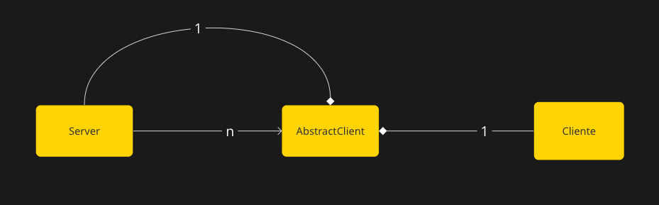

# Repaso de Docker

## Ejercicio 1

El programa ```create_docker_compose.py``` crea un archivo copiando ```docker-compose-dev.yaml```, y segun el numero recibido por parametro, escribe en el archivo la cantidad de clientes deseada, y finalmente, reemplaza el archivo.

Para ejecutar, correr la siguiente instruccion por linea de comandos:  
``` python3 create-docker-compose.py X ```  
Siendo X el numero de clientes a declarar

## Ejercicio 2
Para comprobar el funcionamiento del volumen, una vez que corro `make docker-compose-up`, modifico los valores de puerto de los archivos `config.ini` para el server, y `config.yaml` para los clientes, luego, cuando vuelvo a ver los logs con `make docker-compose-logs`, veo que los clientes pudieron comunicarse con el server ambos utilizando el nuevo puerto.

## Ejercicio 3
Dentro de la carpeta `server_test`, ejecutar `./test.sh`para ejecutar el script, esto creara un archivo llamado `test.txt`, el cual contendra el resultado del comando nc y la debajo la respuesta recibida por parte del servidor.

## Ejercicio 4
Se añadieron handlers de `SIGTERM` en ambos server y client. Los cuales funcionan dela siguiente manera:
#### Server
Al principio de la funcion de loop del server andes de empezar el loop, declaro,  usando la libreria signal, cual va a ser la funcion a ejecutar una vez recibida la signal `SIGTERM`. En este caso, lo que realiza la funcion la cual llame `handle_sigterm` es setear el campo `running` del servidor en `False` y cerrar todos los sockets de clientes activos y por ultimo, cerrar el socket del server.

#### Cliente
De la misma forma que en el server, se declara un canal por el cual entrara la señal `SIGTERM`, lo que significa que, en caso de que se escriba algo por ese canal, significa que el programa recibio la signal.
Luego, dentro del loop principal, se evaluan dos opciones: caso de timeout, que no nos interesa en este caso y caso `sigchan`, donde se procedera a cerrar la conexion del cliente y salir de la funcion.

# Comunicación

## Ejercicio 5

### Definicion de protocolo para envio de mensajes
Para el intercambio de mensajes se definio un protocolo simple, el cual se espera evolucione en siguientes iteraciones.

Consiste en dos partes:
#### Mensajes de cliente a server
Los mensajes enviados al server estan conpuestos por un header conformado por la longitud del payload y el payload, que contiene los campos correspondientes para la conformacion de una apuesta separados por el caracter `|` y en el siguiente orden:  
`header|nombre|apellido|dni|nacimiento|numero`


#### Mensajes de server a cliente
Aprovechando la funcion de lectura utilizada previamente en el cliente `ReadString('\n')`, el cliente le respondera al cliente mensajes con la siguiente estructura:  
`Header | ack/err bet.document bet.number\n`  
Con el payload del mensaje separado por espacios (`" "`), siendo la primera palabra ack en caso de que se haya podido guardar la apuesta correctamente, y err en caso contrario.  
En caso de error, se descarta la apuesta.  
Luego, el servidor leera lo que encuentre en el socket hasta encontrarse con el caracter `\n`, el cual significara el fin del mensaje.  

### Evitar short reads y short writes
Para esto, se implementarion funciones tal que, sabiendo a naturaleza de los sockets de no siempre enviar o leen todo lo requerido al momento de llamar las funciones propias, cuentan la cantidad de bytes leidos o escritos segun corresponda, y en caso de que no sea suficiente, se entra en un loop en el cual se repite la accion hasta poder obtener la cantidad necesaria para proceder.  
En este caso, se entra en el loop hasta encontrar el caracter `\n`.

### Logica de negocios
Se declararon variables en el `env` del cliente en el archivo `docker-compose-dev.yaml` los cuales se utilizara para conformar el mensaje siguiendo el protocolo.
Una vez el cliente envia los datos de la puesta y el servidor puede guardarla correctamente, se imprimira por el log el mensaje correspondiente.

### Separacion de responsabilidades entre modelo de dominio y capa de comunicacion
La idea de esta separacion es que ni el cliente ni el server conozcan la logica del envio y lectura de mensajes, situandolos en un archivo distinto.  
Al estar apretado con el tiempo, dejare este requisito para un refactor futuro, el cual tambien contempla el movimiento de constantes y configuraciones a un archivo distinto.

## Ejercicio 6
El primer cambio necesario para este requerimiento es modificar el docker-compose file para que el cliente reciba por medio de un volumen el archivo con su dataset correspondiente, esto se hace de la misma forma que en el ejercicio 2.  
El server, por su parte, durante cada conexion, mantiene un loop de lectura de mensajes, contandolos hasta conseguir `batch_size` mensajes, para luego procesarlos y proceder a cerrar la conexion.  

### Batches
Por cada loop en el cliente, se enviaran varias apuestas, ahora separadas por el caracter `$`.
Luego, un mensaje tendra la siguiente forma:  
`<header>|<Apuesta1>$<Apuesta2>$ ...`

Todo ese mensaje tendra un header compuesto por los siguientes campos:  
`<batch size> <long. de mensaje> <ultimo batch>`

El campo ultimo batch tendra el valor 1 si es el ultimo, y 0 si quedan batches por enviar.
En el caso de recibir un mensaje `err`, se vuelve a enviar el batch y a esperar respuesta hasta que la misma sea satisfactoria. 

### Consideraciones de rendimiento
Despues de cada batch, se reinicia la conexion con el cliente, de forma tal que un el server puede procesar apuestas recibidas por distintos clientes intercaladamente, esto sirve para evitar el "efecto convoy", lo que significa que un cliente con pocas apuestas que enviar no debe esperar a que otro cliente con miles de apuestas mas que el termine de enviar todas las suyas, lo que propone una gran ventaja para los clientes, pero agrega el overhead de tener que volver a establecer la conexion al menos `apuestas/batch_size` veces.

## Ejercicio 7 

### Cliente
Una vez que el cliente termina de enviar todas las apuestas, crea otra conexion con el server, envia el mensaje de consulta de ganadores y queda esperando por la respuesta. 

### Server
Ahora el server debe llevar la cuenta de la cantidad de clientes que terminaron de enviar apuestas, para que una vez hayan terminado todos, realizar el sorteo. Al recibir el mensaje `winners`, el servidor guarda los socket correspondientes a pedidos de ganadores en un diccionario propio, usando el numero de agencia como llave, y luego, se usara una vez terminado el sorteo para comunicarle el resultado a cada cliente.  
Una vez que el tamaño del diccionario alcance la cantidad de clientes, se realizara el sorteo. 

### Sorteo
El sorteo se ejecutara con las bets recibidas, y utilizando las funciones provistas por la catedra. Se cuenta la cantidad de ganadores y se guarda en un diccionario, utilizando como llave el numero de agencia, una lista de DNIs de ganadores.
Esta lista se utilizara posteriormente para enviar la respuesta a los clientes, obteniendo el socket de cada uno del diccionario guardado anteriormente en el server.

## Ejercicio 8

Para poder conseguir paralelismo en el servidor tendre que utilizar la libreria `multiprocessing`, para poder evitar el GIL, utilizando subprocesos en vez de threads.

El servidor debera tener un subproceso por cliente, llamado Abstract client. luego, solo se comunicara con sus abstracciones de un cliente, las cuales se ejecutan en paralelo.



Con esta imagen se pueden apreciar las dependencias: 
+ Un Abstractclient esta compuesto por un cliente y un server ya que no puede existir sin ellos.
+ Un server tiene N Abstractclients, dependiendo de las conexiones con clientes que necesite.


### Cliente

Al ya no ser necesario evitar el Convoy Effect por paralelismo del server de procesar mensajes y aceptar conexiones, el cliente mantiene una sola conexion a lo largo de toda su ejecucion. 


### Abstract client

Esta abstraccion del cliente por parte del server es la que se comunicara con el cliente y se encargara de procesar los mensajes recibidos y guardar apuestas, de esa forma, el servidor puede encargarse de aceptar nuevas conexiones sin verse interrumpido con el procesamiento de mensajes.

Al momento de la creacion recibe el archivo junto con un lock, entonces, debera pedir el lock cada vez que necesite guardar las apuestas recibidas y asi evitar race conditions para modificar el archivo.

La clase cuenta un Pipe para la comunicacion con el server, por el cual solo envia dos mensajes: `winners` y `exit` dependiendo el caso.
Para el primer caso, una vez enviado el mensaje, espera la respuesta del server y se la reenvia al cliente. En el segundo caso, una vez que el cliente le avisa que termina la conexion, cierra el socket con el cliente y le envia el mensaje al server avisando que puede hacer join del proceso.

### Server

El server ahora cada vez que recibe una conexion, crea un Abstract client y lo guarda en un diccionario utilizando el socket del cliente como llave. Una vez que tiene la cantidad de clientes activos deseada, empieza a leer de a uno de los Pipes de sus Abstract Clients hasta haber enviado los ganadores y posteriormente, joineado todos los procesos.

El server continua teniendo la logica de sorteo, por lo cual necesita comunicarse con los procesos para enviar los resultados.

